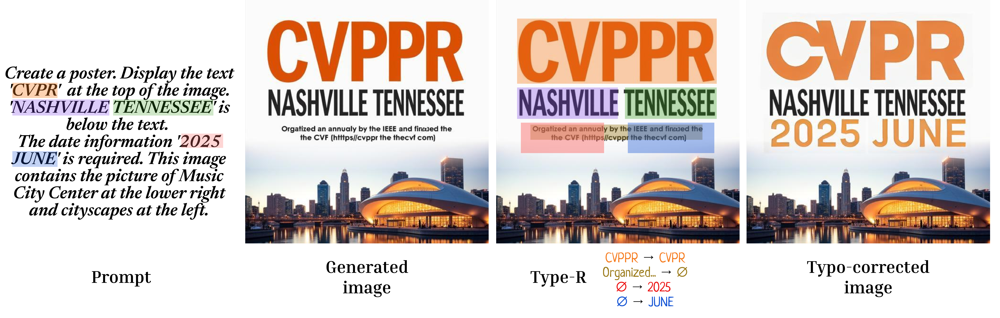
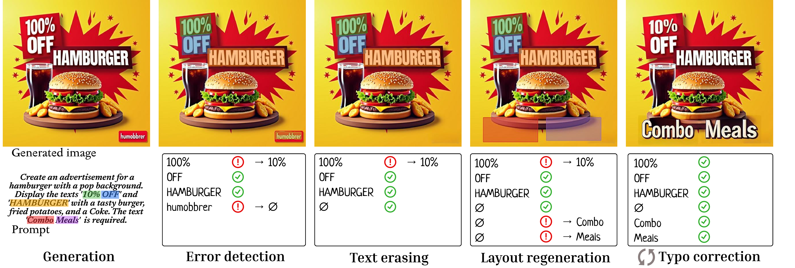

<div align="center">
<h1> <a href="https://arxiv.org/abs/2411.18159">Type-R: Automatically Retouching Typos for Text-to-Image Generation</a> </h1>

<h4 align="center">
    <a href="https://scholar.google.co.jp/citations?user=fdXoV1UAAAAJ">Wataru Shimoda</a><sup>1</sup>&emsp;
    <a href="https://naoto0804.github.io/">Naoto Inoue</a><sup>1</sup>&emsp;
    <a href="https://sites.google.com/view/daichiharaguchi/english">Daichi Haraguchi</a><sup>1</sup>&emsp;<br>
    <a href="https://scholar.google.com/citations?user=rSAChi4AAAAJ">Hayato Mitani</a><sup>2</sup>&emsp;
    <a href="https://human.ait.kyushu-u.ac.jp/~uchida/index-e.html">Seichi Uchida</a><sup>2</sup>&emsp;
    <a href="https://sites.google.com/view/kyamagu">Kota Yamaguchi</a><sup>1</sup>&emsp;
    <br>
    <br>
    <sup>1</sup>CyberAgent, <sup>2</sup>Kyushu University
</h4>

<h4 align="center">
Accepted to CVPR 2025 as a highlight paper
</h4>

<!--  -->

</div>

<div align="center">

[](https://arxiv.org/abs/2411.18159)
<a href='https://cyberagentailab.github.io/Type-R/'></a>

</div>




The repository is the official implementation of the paper entitled Type-R: Automatically Retouching Typos for Text-to-Image Generation.  


# Pipeline
The implementation of Type-R in this repository consists of a three-step pipeline: 
- Text-to-image generation
  - Generate images from prompts.
- Layout correction
  - Performs layout refinement by detecting errors, erasing text, and regenerating the layout.
- Typo correction.  
  - Renders corrected raster text using a text editing model with OCR-based verification

The pipeline is designed to be plug-and-play, with each module configured using [Hydra](https://github.com/facebookresearch/hydra).  
All configuration files are located in [src/type_r_app/config](src/type_r_app/config).




# Requirements

## 📘 Environment
We check the reproducibility under this environment.
- Ubuntu 24.04
- Python 3.12
- CUDA 12.6
- [PyTorch](https://pytorch.org/get-started/locally/) 2.7.0
- [uv](https://docs.astral.sh/uv/) 0.7.6


## 📘 Install
This project manages Python runtime via [uv](https://docs.astral.sh/uv/).  
This project depends on several packages that involve heavy compilation such as [Apex](https://github.com/NVIDIA/apex), [MaskTextSpotterv3](https://github.com/MhLiao/MaskTextSpotterV3), [DeepSolo](https://github.com/ViTAE-Transformer/DeepSolo), and [Detectron2](https://github.com/facebookresearch/detectron2).  

This project assumes that the environment includes a GPU and CUDA support.
If your system does not have CUDA installed, you can install the required CUDA components using the following commands:
```bash
wget https://developer.download.nvidia.com/compute/cuda/repos/ubuntu2404/x86_64/cuda-keyring_1.1-1_all.deb
sudo dpkg -i cuda-keyring_1.1-1_all.deb
```

Then, install the required build tools using the command below:
```bash
apt-mark unhold $(apt-mark showhold)
apt update
apt -y install \
  libfontconfig1 \
  libglib2.0-0 \
  cuda-nvcc-12-6 \
  cuda-profiler-api-12-6 \
  libcusparse-dev-12-6 \
  libcublas-dev-12-6 \
  libcusolver-dev-12-6 \
  python3-dev \
  libgl1 
```
For more details, see the [Dockerfile](Dockerfile).

> ⚠️ The above command assumes that CUDA 12.6 is already installed.  
> If you're using a different CUDA version, replacing `12-6` with the appropriate version number should work.  


Once the build dependencies are installed, run the following command:
```bash
git clone --recursive https://github.com/CyberAgentAILab/Type-R
cd Type-R
./script/apply_patch.sh
uv sync
```

> ⚠️ uv sync may take up to 30 minutes due to building some dependencies. If it completes instantly, your environment might be misconfigured. In that case, refer to the Dockerfile, or try building within a Docker container.  
> ⚠️ This project uses a namespace package, which is currently incompatible with editable installs. Be sure to pass the --no-editable option to uv when syncing dependencies.  

To reset the applied patch:
```bash
./script/clean_patch.sh
```


## 📘 Data resources

We provide the data resources via [Hugging Face Datasets](https://huggingface.co/cyberagent/type-r).
You can download them using the following command:

```bash
uv run python tools/dl_resources.py
```

These resources include pretrained model weights, the MarioEval benchmark dataset, and font files.

> ⚠️ Some resources with stricter licenses must be downloaded manually.
Please refer to the [link](https://huggingface.co/cyberagent/type-r) for details.

## 📘 GPU resources
Type-R requires different machine specs for each step: 
- text-to-image generation
  - The text-to-image generation step requires a large amount of VRAM—more than an A100 40GB GPU, especially when using Flux.
  - > ⚠️ The `run_on_low_vram_gpus` option in [src/type_r_app/config/t2i/flux.yaml](src/type_r_app/config/t2i/flux.yaml) allows the model to run on an L4 machine, but inference may take a few minutes.
- layout correction
  - Layout correction is relatively lightweight in terms of computational cost compared to the other steps.
- typo correction.  
  - Typo correction requires a GPU with L4-level specifications when using AnyText.


## 📘 Permissions of text-to-image models
Flux requires authentication of your Hugging Face profile in order to download model files.
Please see their [model card](https://huggingface.co/black-forest-labs/FLUX.1-dev) for more information.
You must authenticate your Hugging Face account before running the text-to-image models in the text-to-image generation step by executing:
```bash
uv run huggingface-cli login
```

# Usage

## 📘 Type-R
### 🔹 Demo
Type-R is designed to be plug-and-play, and module selection is managed via [Hydra](https://github.com/facebookresearch/hydra) configuration.  
We provide a convenient script to try Type-R using a sample prompt.

To run the demo (configured via [src/type_r_app/config/demo.yaml](src/type_r_app/config/demo.yaml)):
``` bash
bash script/demo.sh
```
- Default output directory: `results/demo`
- Input prompts are read from [resources/prompt/example.txt](https://huggingface.co/cyberagent/type-r/blob/main/prompt/example.txt)
- Prompts should be separated by line breaks, with renderable text enclosed in double quotes (")


### 🔹 Mario-Eval Benchmark (Trial version)

A script is also provided for running Type-R on the [Mario-Eval benchmark](https://github.com/microsoft/unilm/tree/master/textdiffuser#chart_with_upwards_trendevaluation) using only components with permissive licenses and no paid APIs.
```bash
bash script/marioevalbench_trial.sh  
```

- Config file: [src/type_r_app/config/marioevalbench_trial.yaml](src/type_r_app/config/marioevalbench_trial.yaml)
- Output directory: `results/marioevalbench_trial`
- Prompt data (including GPT-4o augmented versions) is provided in: [resources/data/marioevalbench/hfds](https://huggingface.co/cyberagent/type-r/tree/main/data/marioevalbench/hfds)

This script is configured to process a subset of 10 images for the ablation study in the MarioEval benchmark.  
See [src/type_r_app/config/dataset/marioeval_trial.yaml](src/type_r_app/config/dataset/marioeval_trial.yaml)


### 🔹 Mario-Eval Benchmark (Best configuration)
This configuration achieves the best results reported in the paper. It uses an external model with a non-commercial license and accesses a paid API.
```bash
bash script/marioevalbench_best.sh  
```
- Config file: [src/type_r_app/config/marioevalbench_best.yaml](src/type_r_app/config/marioevalbench_best.yaml)
- Output directory: `results/marioevalbench_best`

> ⚠️ Layout correction assumes that the OpenAI API is used. See the usage of the setting from [OpenAI API config](https://github.com/CyberAgentAILab/Type-R-dev#-openai-api-configuration).   
> To use Azure OpenAI instead, set `use_azure: true` in [src/type_r_app/config/marioevalbench_best.yaml](src/type_r_app/config/marioevalbench_best.yaml):

This script is configured to process a subset of all 500 images for the ablation study in the MarioEval benchmark.  
See [src/type_r_app/config/dataset/marioeval.yaml](src/type_r_app/config/dataset/marioeval.yaml)　　

To run the test set of the MarioEval benchmark, set `sub_set: test` in [src/type_r_app/config/dataset/marioeval.yaml](src/type_r_app/config/dataset/marioeval.yaml).  
Please note that this will process 5,000 images.


## 📘 Evaluation
We provide evaluation scripts in this repository.
To run the evaluation scripts on images generated with the best setting:

```bash
uv run python -m type_r_app --config-name marioevalbench_best command=evaluation
```
- You can change the evaluation target by editing the YAML config.
- By default, evaluation includes: VLM evaluation, OCR accuracy, FID score, and CLIPScore.


### VLM evaluation options.
- VLM evaluation requires a paid API.
- By default, the system evaluates graphic design quality using `rating_design_quality`.
- To evaluate other criteria, modify the `evaluation` field in [src/type_r_app/config/evaluation.yaml](src/type_r_app/config/evaluation.yaml).

> ⚠️ The VLM evaluation assumes that the OpenAI API is used. See the usage of the setting from [OpenAI API config](https://github.com/CyberAgentAILab/Type-R-dev#-openai-api-configuration).   
> To use Azure OpenAI instead, set `use_azure: true` in [src/type_r_app/config/evaluation.yaml](src/type_r_app/config/evaluation.yaml):


## 📘 Prompt augmentation
We provide both the data and the code for prompt augmentation. This process requires a paid API.
```bash
uv run python -m type_r_app --config-name demo command=prompt-augmentation
```
- Input: [resources/prompt/example.txt](https://huggingface.co/cyberagent/type-r/blob/main/prompt/example.txt)
- Output: `prompt/augmented.txt` under the configured results directory
- Optionally, HFDS format output is also supported (see [src/type_r_app/launcher/prompt_augmentation.py](src/type_r_app/launcher/prompt_augmentation.py))

> ⚠️ Prompt augmentation assumes that the OpenAI API is used. See the usage of the setting from [OpenAI API config](https://github.com/CyberAgentAILab/Type-R-dev#-openai-api-configuration). 
  
> To use Azure OpenAI instead, set `use_azure: true` in [src/type_r_app/config/prompt_augmentation.yaml](src/type_r_app/config/prompt_augmentation.yaml):


## 📘 OpenAI API configuration
This repository manages the configuration of the OpenAI API via environment variables.
Please set the following variable:
- `OPENAI_API_KEY`

To use the Azure OpenAI API instead, please configure the following environment variables accordingly:
- `OPENAI_API_VERSION`
- `AZURE_OPENAI_DEPLOYMENT_NAME`
- `AZURE_OPENAI_GPT4_DEPLOYMENT_NAME`
- `AZURE_OPENAI_ENDPOINT`
- `AZURE_OPENAI_API_KEY`

Note that we only verified the basic functionality of the Azure OpenAI API.


## 📘 Result
We assume the output directory is as follows:
<pre>
results/
├── ref_img               # T2I-generated images
├── layout_corrected_img  # Images with surplus text removed
├── typo_corrected_img    # Final output
├── word_mapping          # JSON files with OT-based mapping
└── evaluation            # Evaluation results
</pre>
To convert the results into an Excel file for easier viewing:
```bash
uv run python tools/result2xlsx.py
```

## 📘 Test

To run tests, run the following.
```bash
uv run pytest tests --gpufunc
```


# License

This project is licensed under the Apache License.  
See [LICENSE](./LICENSE) for details.

### Third-party licenses

This project depends on the following third-party libraries/components, each of which has its own license:

#### OCR-related projects

- [Deepsolo](https://github.com/ViTAE-Transformer/DeepSolo) — Licensed under [Adelaidet](https://github.com/ViTAE-Transformer/DeepSolo/blob/main/LICENSE)
- [MaskTextSpotterV3](https://github.com/MhLiao/MaskTextSpotterV3) — Licensed under [CC BY-NC 4.0](https://github.com/MhLiao/MaskTextSpotterV3/blob/master/LICENSE.md)
- [Apex](https://github.com/NVIDIA/apex) — Licensed under [BSD 3-Clause](https://github.com/NVIDIA/apex/blob/master/LICENSE)
- [CRAFT](https://github.com/clovaai/CRAFT-pytorch) — Licensed under [MIT License](https://github.com/clovaai/CRAFT-pytorch/blob/master/LICENSE)
- [MaskRCNN Benchmark](https://github.com/facebookresearch/maskrcnn-benchmark) — Licensed under [MIT License](https://github.com/facebookresearch/maskrcnn-benchmark/blob/main/LICENSE)
- [Clova Recognition](https://github.com/clovaai/deep-text-recognition-benchmark) — Licensed under [Apache 2.0](https://github.com/clovaai/deep-text-recognition-benchmark/blob/master/LICENSE.md)
- [Detectron2](https://github.com/facebookresearch/detectron2) — Licensed under [Apache 2.0](https://github.com/facebookresearch/detectron2/blob/main/LICENSE)
- [Hi-SAM](https://github.com/ymy-k/Hi-SAM) — Licensed under [Apache 2.0](https://github.com/ymy-k/Hi-SAM/blob/main/LICENSE)
- [Paddle](https://github.com/PaddlePaddle/PaddleOCR) — Licensed under [Apache 2.0](https://github.com/PaddlePaddle/PaddleOCR/blob/main/LICENSE)


#### Text editor

- [AnyText](https://github.com/tyxsspa/AnyText) — Licensed under [Apache 2.0](https://github.com/tyxsspa/AnyText/blob/main/LICENSE)
- [UDiffText](https://github.com/ZYM-PKU/UDiffText) — Licensed under [MIT License](https://github.com/ZYM-PKU/UDiffText/blob/main/LICENSE)

#### Text remover

- [Lama](https://github.com/advimman/lama) — Licensed under [Apache 2.0](https://github.com/advimman/lama/blob/main/LICENSE)
- [Garnet](https://github.com/naver/garnet) — Licensed under [Apache 2.0](https://github.com/naver/garnet/blob/master/LICENSE)


#### Evaluation metrics

- [CLIP score](https://github.com/jmhessel/clipscore) — Licensed under [MIT License](https://github.com/jmhessel/clipscore/blob/main/LICENSE)
- [Pytorch FID](https://github.com/mseitzer/pytorch-fid) — Licensed under [Apache 2.0](https://github.com/mseitzer/pytorch-fid/blob/master/LICENSE)
- [VLMEval](https://github.com/open-compass/VLMEvalKit) — Licensed under [Apache 2.0](https://github.com/open-compass/VLMEvalKit/blob/main/LICENSE)

#### Data
- [Mario-Eval Benchmark](https://github.com/microsoft/unilm/tree/master/textdiffuser#chart_with_upwards_trendevaluation) — Licensed under [MIT License](https://github.com/microsoft/unilm/blob/master/LICENSE)


### No license projects
Our repository does not contain code from the following repositories due to the absence of a license.  
Please gather codes and weights from the following links.
- [CLIP4str](https://github.com/large-ocr-model/large-ocr-model.github.io) — Licensed under N/A
- [Mostel](https://github.com/qqqyd/MOSTEL) — Licensed under N/A
- [TextCtrl](https://github.com/weichaozeng/TextCtrl) — Licensed under N/A


# Citation

If you find this code useful for your research, please cite our paper:

```
@inproceedings{shimoda2025typer,
  title={{Type-R: Towards Reproducible Automatic Graphic Design Generation}},
  author={Wataru Shimoda and Naoto Inoue and Daichi Haraguchi and Hayato Mitani and Seiichi Uchida and Kota Yamaguchi},
  booktitle={Proceedings of the IEEE/CVF Conference on Computer Vision and Pattern Recognition (CVPR)},
  year={2025},
}
```

